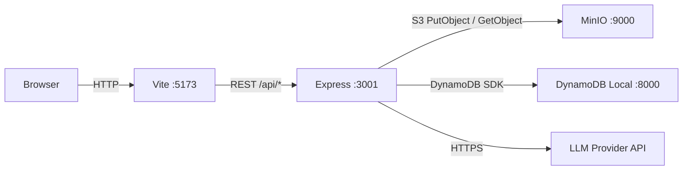

# Architecture — DocChat

_Last updated: Phase 4 — LLM Integration (Strategy Pattern)_

---

## Folder Structure

```
docChat/
├── docker-compose.yml
├── .env.example
├── docs/
├── backend/
│   ├── Dockerfile / jest.config.js / package.json / tsconfig.json
│   └── src/
│       ├── index.ts                       # App entry
│       ├── config/env.ts                  # Typed env config
│       ├── middleware/
│       │   ├── auth.ts                    # JWT Bearer verification
│       │   ├── errorHandler.ts            # Global JSON error handler
│       │   └── upload.ts                  # Multer: memory, 20MB, PDF/CSV/TXT
│       ├── routes/
│       │   ├── auth.routes.ts
│       │   ├── document.routes.ts
│       │   └── chat.routes.ts
│       ├── controllers/
│       │   ├── auth.controller.ts
│       │   ├── document.controller.ts
│       │   └── chat.controller.ts
│       ├── services/
│       │   ├── auth.service.ts            # bcrypt + JWT
│       │   ├── storage.service.ts         # MinIO/S3 adapter
│       │   ├── extractor.service.ts       # PDF/CSV/TXT text extraction
│       │   └── llm/
│       │       ├── llm.interface.ts       # ILLMProvider, LLMMessage, LLMResponse
│       │       ├── llm.factory.ts         # getLLMProvider(name) → ILLMProvider
│       │       ├── claude.provider.ts     # Anthropic SDK + prompt caching
│       │       ├── openai.provider.ts     # OpenAI SDK
│       │       ├── mistral.provider.ts    # Mistral SDK
│       │       └── ollama.provider.ts     # raw fetch to Ollama /api/chat
│       ├── models/
│       │   ├── user.model.ts              # DynamoDB Users table
│       │   └── document.model.ts          # DynamoDB Documents table
│       └── utils/
│           ├── logger.ts
│           └── chunk.ts                   # Sliding-window text chunker
└── frontend/
    └── src/
        ├── api/client.ts
        ├── context/AuthContext.tsx
        ├── hooks/
        │   ├── useAuth.ts
        │   └── useDocuments.ts
        ├── pages/
        │   ├── LoginPage.tsx
        │   ├── DocumentsPage.tsx          # Upload + list
        │   └── ChatPage.tsx               # Stub — Phase 4
        └── components/
            ├── Navbar.tsx
            ├── DropZone.tsx               # react-dropzone
            └── DocumentList.tsx           # File list with delete + select
```

---

## Data Flow



---

## Upload Flow

```
POST /api/documents  (multipart/form-data, file field)
  → multer: validate mime + size → buffer in memory
  → storage.service: PutObject to MinIO (key = userId/uuid-filename)
  → extractor.service: extractText(buffer, mimeType)
      PDF  → pdf-parse
      CSV  → csv-parse/sync → join rows
      TXT  → buffer.toString('utf-8')
  → chunk.ts: chunkText(text, 1000 tokens, 200 overlap)
  → document.model: createDocument → DynamoDB
  → return { document }
```

---

## DynamoDB Tables

### Users

| Key | Type | Notes |
|---|---|---|
| PK | String | `USER#<uuid>` |
| email | String | GSI: EmailIndex (HASH) |
| hashedPassword | String | bcrypt 12 rounds |
| name | String | |
| createdAt | String | ISO 8601 |
| preferredLLM | String | Default: "claude" |

### Documents

| Key | Type | Notes |
|---|---|---|
| PK | String | `DOC#<uuid>` |
| GSI1PK | String | `USER#<userId>` — GSI: UserDocumentsIndex |
| filename | String | Original file name |
| mimeType | String | application/pdf, text/csv, text/plain |
| s3Key | String | MinIO object key |
| sizeBytes | Number | |
| uploadedAt | String | ISO 8601 |
| extractedText | String | Full extracted text |
| chunks | List | string[] from chunkText |

---

## API Surface

| Method | Path | Auth | Description |
|---|---|---|---|
| GET | /health | No | Backend liveness |
| POST | /api/auth/register | No | Register → token + user |
| POST | /api/auth/login | No | Login → token + user |
| GET | /api/auth/me | Yes | Current user |
| PATCH | /api/auth/preferences | Yes | Update preferredLLM |
| POST | /api/documents | Yes | Upload file |
| GET | /api/documents | Yes | List user's documents |
| GET | /api/documents/:id | Yes | Get document + presigned URL |
| GET | /api/documents/:id/chunks | Yes | Debug: get chunks |
| DELETE | /api/documents/:id | Yes | Delete file + metadata |
| POST | /api/chat | Yes | Chat with a document |

---

## Chat Flow

```
POST /api/chat  { documentId, message, history[] }
  → authenticate (JWT)
  → getDocumentById → ownership check
  → getUserById → read preferredLLM
  → getLLMProvider(preferredLLM) → ILLMProvider instance
  → buildSystemPrompt(filename, chunks[:20])
  → provider.ask(systemPrompt, [...history, { role:"user", content: message }])
  → return { response, provider, model, tokensUsed }
```

## LLM Strategy Pattern

```
Controller
  └─ getLLMProvider(name)          ← llm.factory.ts
        └─ ILLMProvider.ask()      ← llm.interface.ts
              ├─ ClaudeProvider    (@anthropic-ai/sdk, prompt caching)
              ├─ OpenAIProvider    (openai SDK)
              ├─ MistralProvider   (@mistralai/mistralai)
              └─ OllamaProvider    (raw fetch, local)
```

Adding a new provider: create `newprovider.provider.ts` implementing `ILLMProvider` + add one line to `providers` map in `llm.factory.ts`.

---

## Design Patterns

| Pattern | Where | Why |
|---|---|---|
| Strategy + Factory | LLM providers (Phase 4) | Swap providers at runtime |
| Repository | `models/*.model.ts` | Isolate DynamoDB access |
| Adapter | `storage.service.ts` | MinIO/S3 same interface |
| Middleware chain | Express | Auth, error handling, upload — composable |
